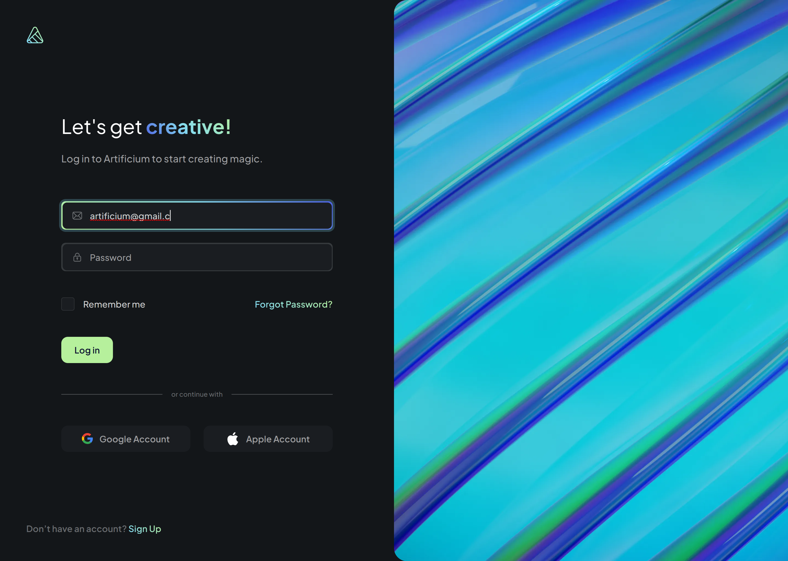

# Artificium

<h4 align="center">
  🚧 In building progress 🚧
</h4>

<br/>

<p align="center">
  
  
  
  
  
  
</p>

## Overview

Based on the "Artificium - AI Content Creation App - UI Kit" public prototype from [Figma](https://www.figma.com/community/file/1237505388738737733)

## Motivation

This application purpose is mainly for studies over the Next.js 13 and TDD development with Cypress.

## How to setup

first clone or download the repository

```
git clone https://github.com/ssluizf/Artificium.git
```

After that you can install the dependencies by executing the following command in the root folder of the project

```
npm install
```

or with yarn

```
yarn
```

**Development Mode**

Run the following script to start the aplicattion on development mode

```
npm run dev
```

or with yarn

```
yarn dev
```

**Firebase Configuration**

For Firebase configuration follow the model file ".env.example" to create a ".env.development" or ".env.production"

**Run documentation (Storybook)**

```
npm run storybook
```

**Run unit testing (Cypress)**
```
npm run component
```